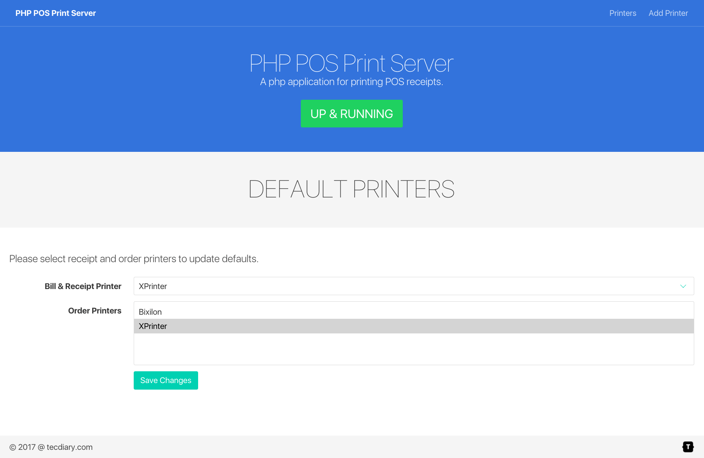
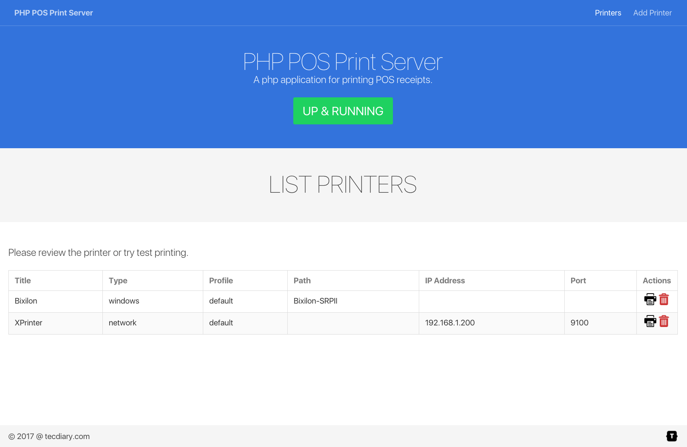
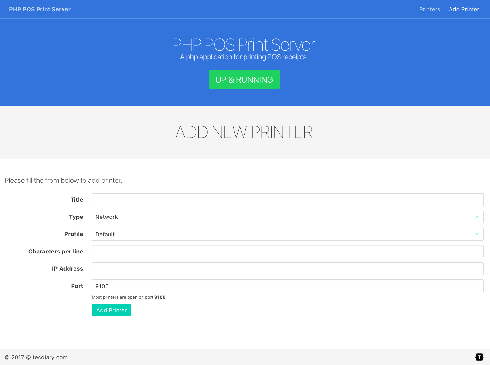

# PHP POS Print (Local Server)

**A [php](http://php.net/) application for printing POS receipts**


### Installation

To clone and run this repository you'll need
[git](https://git-scm.com),
[php](http://php.net/) &
[composer](https://getcomposer.org/).

From your command line:

```bash

# Clone this repository
git clone https://github.com/Tecdiary/ppp

# Go into the repository
cd ppp

# Install dependencies
composer install

# Start server from command line
php server.php

# Start app for settings
php -S localhost:8000 -t app/
```

Next time you can simply run `php server.php` in command line OR `server.sh` file to start the server.

This app runs at port 6441 ( ws://lcoalhost:6441 ) and listen for the print jobs.

***
# Get Windows Installer

**Users having difficulty installing the ppp, can purchase standalone windows installer from link below**

**[PHP POS Print Server (Windows Installer)](http://tecdiary.com/products/php-pos-print-server-windows-installer) http://tecdiary.com/products/php-pos-print-server-windows-installer** 

**Get 10% discount with offer code `ppp` (for limited time only).**

It comes with logs feature. The server logs can be viewed or downloaded.

The license is not transfer-able, so please don't install it on test server. 
***

### Local printers
Server will try to use the local printers if no printer has been provided.
You can access local app from your local web server url or just run `php -S localhost:8000 -t app/` and access the app in browser http://localhost:8000

**App Features**
- Main index page `index.php` to update your default printers
- Printers page `printers.php` to list all your printers
- Add Printer page `add_printer.php` to add new printer

The local settings will be saved in `database/data.json` file.

**Screenshots**

Index page


Printers page


Add printer page

